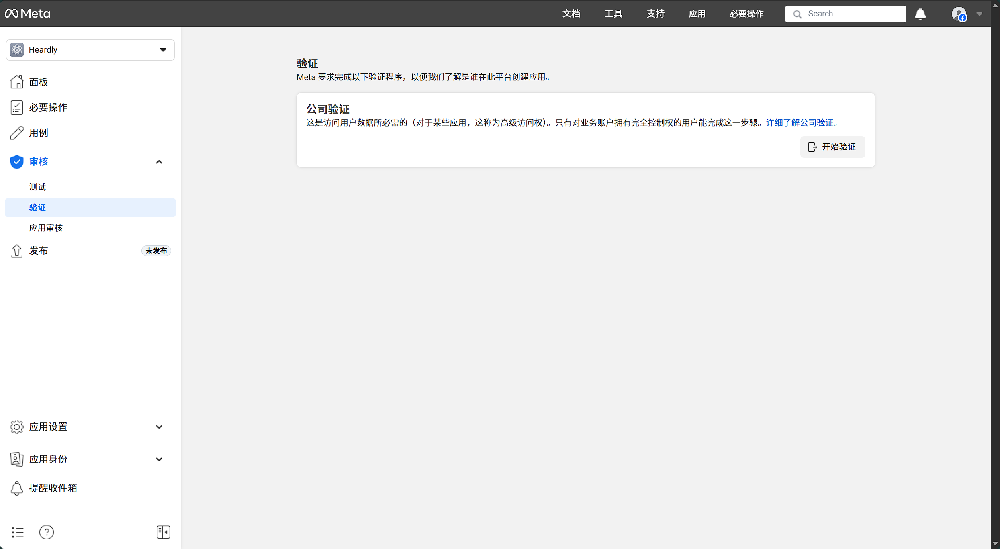

# 登录功能支持需求说明

## 📋 需求概述

当前系统需要支持以下4种登录方式：
- ✅ Facebook 登录
- ✅ Google 登录
- ⚠️ Apple 登录（Web端 + 移动端集成）
- ⚠️ SSO 企业单点登录

---

## 📊 当前状态

### ✅ 已完成
- **Facebook 登录**：前端功能已实现，后端 API 待对接，需要完成公司验证等操作，获取回调API
[脸书开发者链接](https://developers.facebook.com/) 

- **Google 登录**：前端功能已实现，后端 API 待对接

### ⚠️ 待完成
- **Apple 登录**：
  - Web端：UI已完成，功能代码待开发
  - 移动端：公司已有移动端Apple登录，需要与Web端集成同步
  
- **SSO 登录**：UI已完成，功能代码待开发

---

## 🎯 需要完成的工作

### 1. Apple 登录（Web端）
**前端开发**：
- 实现 Apple 登录按钮点击处理逻辑
- 集成 Apple OAuth 2.0 流程

**后端开发**：
- 扩展 OAuth 回调接口支持 Apple
- 实现 Apple JWT 验证和用户信息获取

**配置工作**：
- 在 Apple Developer 创建 Service ID
- 配置重定向 URI 和密钥

**预计工作量**：2-3 天

---

### 2. Apple 登录（移动端集成）
**集成工作**：
- 与移动端团队确认数据同步方案
- 实现移动端登录后的 Web 端会话同步
- 处理账号关联逻辑

**预计工作量**：1-2 天

---

### 3. SSO 企业单点登录
**前端开发**：
- 实现 SSO 登录跳转逻辑
- 处理 SSO 回调

**后端开发**：
- 实现 SSO 认证端点
- 集成 SSO 提供商 SDK（如 Okta、Auth0、Azure AD）
- 处理用户信息映射

**配置工作**：
- 确定 SSO 提供商并完成应用配置
- 配置用户属性映射规则

**预计工作量**：3-5 天（取决于 SSO 提供商复杂度）

---

## 🔧 技术需求

### 环境变量配置
需要添加以下配置项：
- Apple OAuth 相关配置（Client ID、Team ID、密钥等）
- SSO 相关配置（根据选择的提供商而定）

### 后端 API 扩展
- 扩展 `/api/auth/oauth/callback` 支持 Apple
- 新增 `/api/auth/sso/initiate` 和 `/api/auth/sso/callback`
- 新增移动端同步接口 `/api/auth/mobile/apple/sync`

### 数据库调整
- 支持多登录方式关联（一个用户可绑定多个登录方式）
- 存储各提供商的用户 ID

---

## ⏱️ 优先级建议

1. **高优先级**：Apple 登录（Web端 + 移动端集成）
2. **中优先级**：SSO 登录

---

## 📅 预计总工作量

- **Apple 登录（Web + 移动端）**：3-5 天
- **SSO 登录**：3-5 天
- **总计**：6-10 个工作日

---

## 📝 备注

- Facebook 和 Google 登录的前端功能已完成，主要需要后端 API 对接
- Apple 登录需要与移动端团队协作完成集成
- SSO 登录的具体实现方案需要先确定提供商（Okta、Auth0、Azure AD 等）

